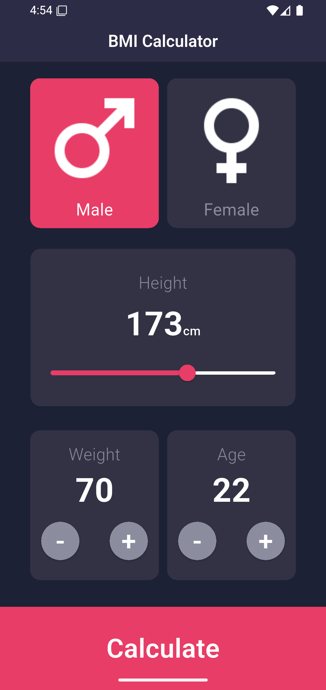
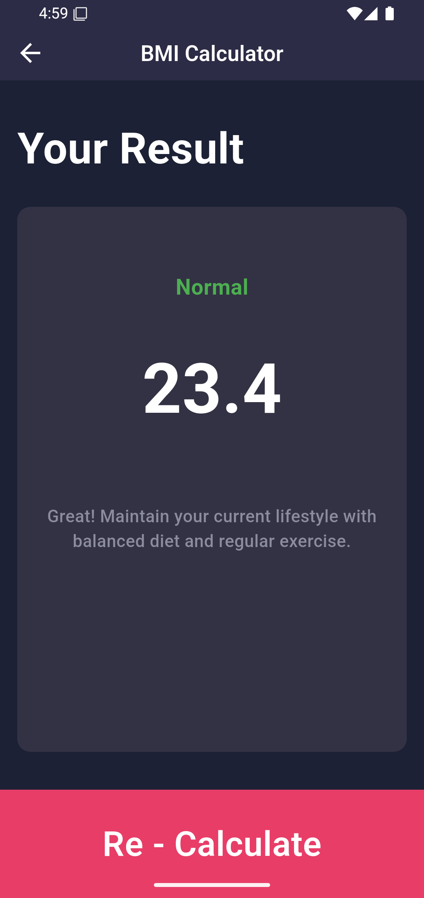

<div align="center">

  # 🏋️‍♂️ BMI Calculator

  **A sleek, modern, dark-themed Body Mass Index (BMI) calculator built with Flutter.**

  [](https://flutter.dev)
  [](https://dart.dev)
  [](https://flutter.dev/multi-platform)
  [](LICENSE)

  <br />

  <p align="center">
    <a href="#-about-the-project">About</a> •
    <a href="#-features">Features</a> •
    <a href="#-demo--ui-preview">Demo & Preview</a> •
    <a href="#-bmi-classification">BMI Classification</a> •
    <a href="#-tech-stack--color-palette">Design & Palette</a> •
    <a href="#-project-structure">Project Structure</a> •
    <a href="#-getting-started">Getting Started</a> •
    <a href="#-roadmap">Roadmap</a> •
    <a href="#-author">Author</a>
  </p>

</div>

---

## 📖 About The Project

**BMI Calculator** is a beautifully designed, intuitive mobile application developed using **Flutter**. It allows users to quickly calculate their Body Mass Index (BMI) by inputting their gender, height, weight, and age. The app provides instant, color-coded health categorization and personalized advice based on standard World Health Organization (WHO) BMI metrics.

Built with a responsive dark-mode aesthetic and modular widget architecture, it offers a seamless user experience with smooth controls and clear visual feedback.

---

## ✨ Features

- 👤 **Interactive Gender Selection**: Easy one-tap toggle between Male and Female cards with active color highlights.
- 📏 **Dynamic Height Slider**: Smooth slider adjustment (100 cm – 220 cm) with live real-time height indicators.
- ⚖️ **Precise Weight & Age Steppers**: Ergonomic circular plus and minus buttons for quick incremental tuning.
- ⚡ **Instant BMI Computation**: Accurate calculation following standard scientific body mass index formulas.
- 🎨 **Dynamic Color Feedback**: Output classification colors adapt dynamically based on your health category:
  - 🔵 **Underweight**
  - 🟢 **Normal**
  - 🟠 **Overweight**
  - 🔴 **Obese**
- 💡 **Tailored Health Advice**: Actionable, category-specific suggestions displayed alongside your score.
- 🔄 **One-Tap Recalculation**: Smooth navigation to re-enter or update your parameters effortlessly.

---

## 🎬 Demo & UI Preview

### 📹 Video Walkthrough

<div align="center">
  <video src="https://youtube.com/shorts/zhtE94SH7Z8?feature=share" width="300" controls></video>
  <p>
    <sub>▶️ <em>Direct video link: <a href="https://youtube.com/shorts/zhtE94SH7Z8?feature=share">bmi-calculator.mp4</a></em></sub>
  </p>
</div>

### 📱 Screenshots

| Home Screen | Result Screen |
|:---:|:---:|
|  |  |

---

## 📊 BMI Classification

The application calculates Body Mass Index using the standard formula:

$$\text{BMI} = \frac{\text{Weight (kg)}}{(\text{Height (m)})^2}$$

| Category | BMI Range ($\text{kg/m}^2$) | Indicator Color | Advice Provided |
| :--- | :---: | :---: | :--- |
| **Underweight** | $< 18.5$ | `Indigo` (`#3F51B5`) | Consider consulting a healthcare provider about healthy weight gain strategies. |
| **Normal** | $18.5 - 24.9$ | `Green` (`#4CAF50`) | Great! Maintain your current lifestyle with balanced diet and regular exercise. |
| **Overweight** | $25.0 - 29.9$ | `Orange` (`#FF9800`) | Consider a balanced diet and increased physical activity to reach a healthier weight. |
| **Obese** | $\ge 30.0$ | `Red` (`#F44336`) | Consult with a healthcare provider for a personalized weight management plan. |

---

## 🎨 Tech Stack & Color Palette

### Technology
- **Framework**: [Flutter](https://flutter.dev) (v3.8+ / Dart 3.x)
- **UI Architecture**: Material 3 Design principles with custom modular components
- **State Management**: Built-in stateful reactive state (`setState`)

### Color Palette

| Color Role | Preview | Hex Code | Usage |
| :--- | :---: | :---: | :--- |
| **Primary Accent** |  | `#E83D67` | Action buttons, active cards, slider thumb |
| **App Background** |  | `#1C2135` | Main scaffold background |
| **Card Surface** |  | `#333244` | Metric cards (Height, Weight, Age) |
| **App Bar Background** |  | `#24263B` | Top navigation app bar |
| **Muted Accent / Text** |  | `#8B8C9E` | Secondary labels and counter buttons |
| **Text Primary** |  | `#FFFFFF` | Primary headers and values |

---

## 📁 Project Structure

```text
BMI-Calculator/
├── android/                 # Android native project files
├── assets/
│   ├── demo/                # App walkthrough video demonstration
│   │   └── bmi-calculator.mp4
│   ├── icons/               # Gender vector & graphic assets
│   │   ├── female_icon.png
│   │   └── male_icon.png
│   └── screenshots/         # App preview screenshots
│       ├── Screenshot_1789307693.png
│       └── Screenshot_1789307951.png
├── ios/                     # iOS native project files
├── lib/
│   ├── main.dart            # Application entry point & route definitions
│   └── views/
│       ├── pages/           # Screen views
│       │   ├── home_page.dart       # Main input dashboard
│       │   └── result_page.dart     # BMI result & health feedback view
│       └── widgets/         # Reusable modular components
│           ├── age_card_widget.dart         # Age stepper card
│           ├── calculate_bmi_widget.dart    # BMI calculation model & logic
│           ├── custom_app_bar_widget.dart   # Styled application bar
│           ├── gender_card_widget.dart      # Gender selection card
│           └── weight_card_widget.dart      # Weight stepper card
├── test/                    # Widget and unit tests
├── pubspec.yaml             # Dependencies and project metadata
└── README.md                # Project documentation
```

---

## 🚀 Getting Started

Follow these instructions to get a copy of the project up and running on your local machine.

### Prerequisites

- [Flutter SDK](https://docs.flutter.dev/get-started/install) (`>= 3.8.1`)
- [Dart SDK](https://dart.dev/get-dart)
- An IDE with Flutter plugins installed: [VS Code](https://code.visualstudio.com/) or [Android Studio](https://developer.android.com/studio)
- An Android/iOS device or emulator

### Installation & Run

1. **Clone the repository:**
   ```bash
   git clone https://github.com/Ahmed-Moataz-glitch/BMI-Calculator.git
   ```

2. **Navigate into the project directory:**
   ```bash
   cd BMI-Calculator
   ```

3. **Install the dependencies:**
   ```bash
   flutter pub get
   ```

4. **Run the application:**
   ```bash
   flutter run
   ```

### Building for Production

- **Android APK:**
  ```bash
  flutter build apk --release
  ```

- **Android App Bundle:**
  ```bash
  flutter build appbundle --release
  ```

---

## 🗺️ Roadmap

- [ ] Support for **Imperial Units** (feet, inches, pounds).
- [ ] Historical records and progress tracking using local database (Hive / SQLite).
- [ ] Visual BMI gauge needle indicator.
- [ ] Shareable result card (export as image / PDF).
- [ ] Multi-language / localization support.

---

## 🤝 Contributing

Contributions are what make the open-source community an amazing place to learn, inspire, and create. Any contributions you make are **greatly appreciated**.

1. Fork the Project
2. Create your Feature Branch (`git checkout -b feature/AmazingFeature`)
3. Commit your Changes (`git commit -m 'feat: add some amazing feature'`)
4. Push to the Branch (`git push origin feature/AmazingFeature`)
5. Open a Pull Request

---

## 👤 Author

**Ahmed Moataz**
- GitHub: [@Ahmed-Moataz-glitch](https://github.com/Ahmed-Moataz-glitch)
- Email: [ahmedmoataz221104@gmail.com](mailto:ahmedmoataz221104@gmail.com)

---

## 📄 License

This project is licensed under the [MIT License](LICENSE) - feel free to use and modify it for your personal or commercial projects.
